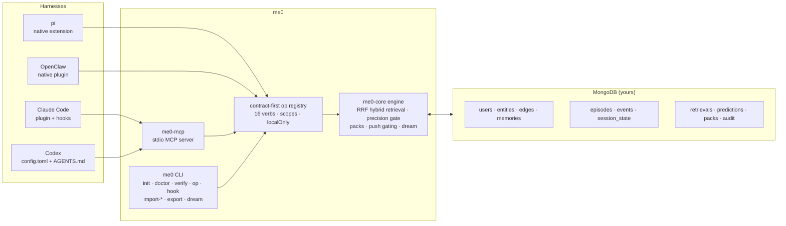

<div align="center">

# me0

### The zeroth layer under every agent: **you.**

**One portable, MongoDB-backed personal context graph + agent session memory for
Claude Code · Codex · pi · OpenClaw · Hermes — switch harnesses freely; your context comes with you.**

[](https://github.com/gratitude5dee/me0/actions/workflows/ci.yml)
[](LICENSE)
[](https://bun.sh)
[](https://www.mongodb.com)
[](https://modelcontextprotocol.io)
[](https://agent-plugins.org)
[](docs/goal.md)
[](#-contributing)

[Quickstart](#-quickstart-60-seconds) · [The Verbs](#-sixteen-verbs-one-protocol) · [MongoDB Inside](#-mongodb-is-the-memory-engine) · [Harness Adapters](#-harness-adapters) · [Benchmarks](#-me0-bench-falsifiable-memory) · [Full Spec](docs/goal.md)

</div>

---

## The one-line test

> Start a task in **Claude Code**, hit your rate limit, open **Codex** — and the second agent already knows who you are, what the task is, and what the first agent tried. **Zero re-explanation.**

```bash
# harness A (about to die):
me0 op handoff '{"episode_id":"ep_...","banked_state":"Fixing auth bug in api/login.ts; JWT refresh fails on expiry; next: add clock-skew tolerance"}'
# → {"token":"hd_..."}

# harness B (first action):
me0 op context_pack '{"resume":"hd_..."}'
# → identity card + resume state + core memories + recent episodes, packed under 700 tokens
```

## Why

Every harness grows its own amnesia workaround — and none of them talk to each other:

| Harness | Its memory | Portable? |
|---|---|---|
| Claude Code | `CLAUDE.md` hierarchy + auto-memory dirs | ❌ |
| Codex | `AGENTS.md` | ❌ |
| pi | JSONL session trees in `~/.pi/agent/sessions/` | ❌ |
| OpenClaw | `MEMORY.md` + `memory/YYYY-MM-DD.md` daily logs | ❌ |
| Hermes | `MEMORY.md` with a 2,200-char cap | ❌ |

me0 inverts ownership: **memory is a property of the person, not the harness.** It lives in a MongoDB *you* control (a local Docker container is the free floor), speaks open protocols (MCP, the Agent Plugins v1.0.0 package format, Agent Skills), and installs into every harness with one command.

## ✨ What's built

| | |
|---|---|
| 🧠 **16 memory verbs, one frozen protocol** | gbrain **MEMORY_VERBS v1**-shaped core (`recall` `remember` `entity` `context_pack` `delta` `forget` `synthesize`) + episodic extension (`episode_*`, `handoff`, `whoami`, `push`, `dream`, `me0_stats`). Every response stamps `protocol_version: 1`. |
| 🗄️ **MongoDB-native memory engine** | 11 collections, 9 under `$jsonSchema` validators; unique compound indexes; text-index recall; bi-temporal facts; soft-delete with a 72-hour purge window; append-only audit. [Details ↓](#-mongodb-is-the-memory-engine) |
| 🔀 **Hybrid retrieval with honest abstention** | Three arms (text index · keyword · entity/alias graph) fused by reciprocal rank fusion (k=60), a 50% content-word **precision gate** that answers `"no recorded memory"` instead of guessing, and evidence labels on every hit. |
| 📼 **First-class episodic memory** | Sessions from *any* harness become `episodes` + `events` with provenance (`harness`, `agent`, `method`); searchable via `episode_recall`; resumable across harnesses via `handoff` tokens. |
| 📦 **Context packs, token-budgeted server-side** | `context_pack` assembles identity card → resume state → core/standing memories → recent episode summaries under a hard budget (default 700 tokens), reporting `budget_used` and `dropped_count`. |
| 📣 **Gated ambient push** | Per-prompt recall that fires only at confidence ≥ 0.7, caps at 3, and suppresses anything already surfaced this session. Every push is logged to `retrievals` — false-fire rate is a CI metric, not a vibe. |
| 🌙 **The nightly dream** | Deterministic consolidation: hard-purge expired soft-deletes, normalized-text dedupe (supersede, don't destroy), heat-based tier promotion/demotion, identity-card recompilation, cached pack refresh. All audited. |
| 🚚 **Migration importers ($0, idempotent)** | `CLAUDE.md` / `AGENTS.md` / `MEMORY.md` / `USER.md` / `SOUL.md`, Claude Code auto-memory + transcripts, pi JSONL sessions, OpenClaw workspaces → typed, provenance-stamped memories. Re-import is a NOOP. |
| 🔌 **Five harness adapters + a portable floor** | Claude Code plugin (hooks), Codex (`config.toml` + `AGENTS.md` preamble), native pi extension, native OpenClaw plugin, Hermes memory provider — plus `plugin.json`/`mcp.json`/skills so any Agent Plugins v1.0.0 client can mount it. |
| 🧪 **Falsifiable memory** | `me0-bench`: recall P@1, adversarial abstention, push precision, pack budget adherence, and a scripted **cross-harness continuity** gate — hermetic in CI, runnable against live deployments. |
| 🔑 **Zero required API keys** | The entire v0.1/v0.2 pipeline — capture, extraction heuristics, retrieval, consolidation, benchmarks — is deterministic. No LLM calls, no embeddings required, no telemetry. Your database, your keys, your memory. |
| 🛡️ **Fail-open, fail-closed** | Hooks never block your agent (fail-open, 10s timeouts); remote callers never widen visibility (fail-closed: `remember`/`forget`/`handoff` are local-only, remote reads are world-visibility only). |
| 🔮 **Predictive layer (me0-rfm)** | Flat-table JSONL export for the KumoRFM LocalGraph bridge + deterministic heuristic predictions (`retrieval_utility`, `prefetch`, `forget`) consumed opportunistically by retrieval ranking. [Details ↓](#-v03--predict--federate) |
| 🌐 **A2A endpoint** | `me0 serve --a2a` — Agent Card, JSON-RPC memory skills, redacted budgeted memory-profile extension. Loopback by default; bearer token required for non-loopback binds; every remote call audited. |

## 🏗️ Architecture



One engine, thin seams: the MCP server, the CLI, and both native adapters all dispatch into the same contract-first operation registry — surface drift is structurally impossible.

## 🍃 MongoDB is the memory engine

me0 doesn't sit *next to* a database — the memory semantics are built out of MongoDB primitives:

| Memory concern | How me0 uses MongoDB today |
|---|---|
| **One schema, five writers** | 9 collections under `$jsonSchema` validators (`validationLevel: moderate`, applied via `createCollection`/`collMod`). Multiple harnesses write concurrently; the *database* enforces the memory contract — kinds, tiers, visibility, provenance are all validator-checked. |
| **Personal context graph** | `entities` (8 types, aliases, salience) + `edges` (typed, weighted, bi-temporal) indexed in both directions (`{user_id, src, rel}`, `{user_id, dst}`) for cheap neighbor expansion. |
| **Bi-temporal truth** | `valid_from` / `valid_until` / `superseded_by` on memories and edges — me0 supersedes, it doesn't destroy. "What did I believe in March?" stays answerable. `forget` soft-deletes (`deleted_at`) with a 72-hour purge window before hard deletion. |
| **Lexical recall** | Text index on `memories.text` with `$meta: "textScore"` ranking as one retrieval arm. |
| **Hybrid fusion, `$rankFusion`-shaped** | The engine fuses three arms with reciprocal rank fusion (k=60) at the app level — deliberately the same shape as native [`$rankFusion`](https://www.mongodb.com/docs/atlas/atlas-vector-search/hybrid-search/), so MongoDB 8.1+/Atlas swaps in natively while `mongo:8` in Docker keeps working keylessly. |
| **Heat, decay, promotion** | `$inc` access counters on every recall feed dream-cycle tiering: ≥5 touches → `standing`, ≥20 → `core`; untouched 60 days → `archive`, cold 30 days → demoted. Ebbinghaus, implemented as an aggregation of counters. |
| **Idempotent migration** | Importers lean on upserts, normalized-text dedupe, and deterministic episode keys (`ep_claude_<hash>`, `ep_pi_<id>`) — re-running any import is a NOOP by construction. |
| **Telemetry as schema** | Every surfaced memory writes a `retrievals` row (surface: `pack|recall|push|delta`); every write lands in an append-only `audit` stream. Retrieval already reads utility weights from a `predictions` collection when present — the learning loop is plumbed. |
| **Identity under uniqueness** | Unique compound indexes (`{user_id, slug}`, `{user_id, memory_id}`, `{user_id, episode_id}`, …) plus `{user_id, tier, kind}` and `{user_id, "prov.episode_id"}` for the hot query paths. |
| **Hermetic by default** | The entire test suite (109 tests) runs on `mongodb-memory-server` — no Atlas account, no API keys, no network. CI gates typecheck, lint (`noExplicitAny: error`), and the full bench. |

**The Atlas on-ramp (v0.3+):** the schema was designed for MongoDB's AI stack before the code caught up — each lands as a swap, not a rewrite:

| Coming | MongoDB feature |
|---|---|
| Semantic recall arm | `$vectorSearch` + Voyage **automated embedding** (define the index, embeddings happen on insert *and* query) |
| Native fusion | `$rankFusion` (8.1+) replacing app-level RRF, `scoreDetails` as evidence |
| Multi-hop graph recall | `$graphLookup` over `edges` (seed with search, expand relationally) |
| Working-memory decay | TTL indexes on raw `events` and `predictions` |
| High-volume session logs | Time-series collections for `events` |
| Live consolidation | Change streams triggering dream steps on write |
| Sealed memories | Queryable Encryption for a never-shared tier |

## ⚡ Quickstart (60 seconds)

```bash
git clone https://github.com/gratitude5dee/me0 && cd me0
bun install
bun link me0-cli && bun link me0-mcp

# storage: any MongoDB — local Docker is the free floor
docker run -d --name me0-mongo -p 27017:27017 mongo:8

me0 init --uri mongodb://127.0.0.1:27017 --user me --name "Your Name"
me0 verify        # exit 0 = write → recall → pack round-trip healthy
```

`me0 init` detects your installed harnesses and wires them in place — Codex (`~/.codex/config.toml` MCP entry + `AGENTS.md` preamble), pi (`~/.pi/agent/extensions/me0.ts`), OpenClaw (`plugins.entries.me0` in `openclaw.json`) — and prints the Claude Code plugin instructions. `me0 doctor` diagnoses drift.

Then talk to your memory from anywhere:

```bash
me0 op remember '{"text":"prefers conventional commits, squash-merge","kind":"preference","tier":"standing"}'
me0 op recall   '{"query":"commit style"}'
me0 op context_pack '{}'
```

## 🔤 Sixteen verbs, one protocol

Frozen core — gbrain **MEMORY_VERBS v1**-shaped, additive-forever, `protocol_version: 1` on every response:

| Verb | Purpose | Scope |
|---|---|---|
| `recall` | hybrid search with evidence labels + honest abstention | read |
| `remember` | typed write (6 kinds · 4 tiers · 3 visibilities), provenance auto-stamped, `create_safety` honored | write · **local-only** |
| `entity` | entity card + graph neighbors, zero-LLM | read |
| `context_pack` | budgeted session-start pack; `resume` accepts handoff tokens | read |
| `delta` | changes since this session's cursor (at-least-once, deduped) | read |
| `forget` | soft-delete by memory or entity scope → 72h purge | admin · **local-only** |
| `synthesize` | cited answer over recall results (keyless citation mode) | read |

Episodic extension (me0 namespace):

| Verb | Purpose |
|---|---|
| `episode_start` / `episode_log` / `episode_end` | session lifecycle + event capture from any harness (**local-only**) |
| `episode_recall` | search past sessions — "what did we try on the auth bug?" |
| `handoff` | bank live state → mint `hd_*` resume token (**local-only**) |
| `push` | gated per-prompt ambient recall (**local-only**) |
| `dream` | run the consolidation cycle (**local-only**, admin) |
| `whoami` | identity card + consent scopes in force |
| `me0_stats` | memory counts, health, budget telemetry |

Exposed three ways, all dispatching the same registry: **me0-mcp** (stdio MCP server with structured content), **me0 CLI** (`me0 op <verb> '<json>'`), and **native adapters** (pi, OpenClaw).

## 🔌 Harness adapters

| Harness | Integration | Capture | Injection | Status |
|---|---|---|---|---|
| **Claude Code** | `.claude-plugin/` plugin: hooks + `mcp.json` + skills | `SessionStart` opens the episode; `SessionEnd` closes it | pack via `hookSpecificOutput.additionalContext`; gated push on `UserPromptSubmit` | ✅ |
| **Codex** | `config.toml` MCP entry + `AGENTS.md` preamble (usage doctrine: pack at start, recall-before-asking, never guess) | episode verbs via MCP | on-demand `context_pack` / `recall` | ✅ |
| **pi** | native TypeScript extension (pi has no built-in MCP — me0 registers 9 `memory_*` tools directly) | `session_start` / `tool_call` / `session_shutdown` events | pack injected at session start | ✅ |
| **OpenClaw** | native plugin: swaps file-based `memory_search`/`memory_get` for the graph, exposes 14 verbs as tools | full lifecycle hooks; **banks a handoff before compaction** (`session:compact:before`) and reopens a fresh episode | `ME0.md` pack at `agent:bootstrap`; `delta` on gateway heartbeat | ✅ |
| **Hermes** | memory-provider plugin (`plugins/memory/me0/`, wired via `hermes config set memory.provider me0`) replacing the 2,200-char `MEMORY.md` cap | `sync_turn` / `on_session_end` / `on_session_switch` / `on_pre_compress` hooks | frozen-snapshot context pack | ✅ |
| **Any Agent Plugins client** | portable floor: `plugin.json` (v1.0.0) + `mcp.json` + `skills/` | pull-only | skill-taught verbs | ✅ |

Three skills teach the tools (`skills/me0`, `me0-handoff`, `me0-setup`) — including the house rule every adapter enforces: *if recall returns no recorded memory, say so; do not guess.*

## 🚚 Bring your memory with you (importers)

Deterministic, provenance-stamped, idempotent — no LLM, no keys:

```bash
me0 import-context            # CLAUDE.md / AGENTS.md / MEMORY.md / USER.md / SOUL.md → typed memories
me0 import-claude             # Claude Code auto-memory + .jsonl transcripts → memories + episodes/events
me0 import-pi                 # ~/.pi/agent/sessions/**/*.jsonl → episodes + events
me0 import-openclaw           # MEMORY.md→facts · USER.md→preferences · SOUL.md→beliefs · daily logs→episodes
me0 import-hermes             # Hermes state.db sessions + memories/*.md → episodes + memories
```

Headings become concept entities; `prefer/always/never` → preference, `decided` → decision, imperative how-tos → procedure, else fact. Everything lands with `method: "deterministic"` provenance and normalized-text dedupe — re-import never duplicates.

## 📊 me0-bench: falsifiable memory

A memory layer that can't be scored is a vibe. `me0-bench` runs a synthetic persona through the full pipeline — hermetically in CI (`bun test`, `mongodb-memory-server`) or against a live deployment (`me0-bench`, exit-code gated):

| Gate | Threshold |
|---|---|
| `recall_p_at_1` | ≥ 0.8 |
| `abstention_accuracy` (adversarial probes) | = 1.0 — never fabricate |
| `push_false_fire_rate` | = 0 |
| `push_hit_rate` | ≥ 0.5 |
| `pack_budget_adherence` | ≤ 700 tokens |
| `continuity_resume_ok` | scripted **claude-code → codex handoff**: banked state must appear in the resume pack |

## 🧭 Design principles

**User-centric, not brain-centric** — the unit is the person, every write attributed `{harness, agent, episode}` · **verbs-first, additive-forever** · **deterministic before LLM** — the whole shipped pipeline is $0 · **provenance + bi-temporality on every memory** · **honest abstention** · **token cost is a first-class metric** · **fail-open hooks, fail-closed remote** · **one tree, many harnesses**.

Full rationale, data model, and the research it stands on (gbrain, memtrace, 90-paper memory survey, Agent Plugins / A2A / MCP specs): [`docs/goal.md`](docs/goal.md).

## 🔮 v0.3 — predict & federate

Shipped:

- **me0-rfm (predictive layer)** — `me0 rfm --out <dir>` exports RFM-friendly flat tables under `<dir>/rfm/` (JSONL: `users`, `memories`, `entities`, `edges`, `sessions`, `tool_calls`, `outcomes`, `retrievals`; redacted structure-only by default, `--no-redact` to keep text) for the KumoRFM LocalGraph bridge, and writes deterministic **heuristic predictions** (`retrieval_utility` = used/surfaced ratio, `prefetch` = recency×frequency, `forget` = Ebbinghaus decay from last retrieval or creation) into `predictions` — consumed opportunistically by retrieval ranking. PQL sketches per task live in `packages/me0-rfm/src/pql.ts`. RFM is an enhancement tier, never a dependency. `me0 dream --rfm` runs it after consolidation.
- **A2A endpoint** (`me0 serve --a2a [--port 4160] [--host <addr>] [--a2a-token <tok>] [--url <public-url>]`) — Agent Card at `/.well-known/agent-card.json` with skills `memory.recall`, `memory.context_pack`, `memory.synthesize`, plus the `https://me0.dev/a2a/ext/memory-profile/v1` extension returning a redacted, budgeted profile pack as a DataPart. Hard rules: A2A callers are `remote` — visibility ceiling `world`, identity card and episode summaries suppressed, local-only verbs rejected, no telemetry mutation, every call audited. Hardened by default: loopback bind unless a bearer token is set (`--a2a-token` / `ME0_A2A_TOKEN`, constant-time compared), 64 KiB byte-enforced body limit, capped parts/budgets/queries, generic remote errors. Put public deployments behind a TLS-terminating reverse proxy.

## 🗺️ Roadmap

- **v0.3+ (remaining):** native KumoRFM execution via the official SDK/MCP bridge, `$vectorSearch` + Voyage automated embeddings, native `$rankFusion`, `$graphLookup` recall arm, TTL + time-series + change streams, LLM session-end extraction (`method: "llm"` provenance is already in the schema), A2A OAuth 2.1.
- **v1.0 — the standard candle:** MEMORY_VERBS conformance certification, marketplace listings, stability guarantees, published benchmark results.

## 📁 Repository layout

```
me0/
├── plugin.json · mcp.json · skills/        # Agent Plugins v1.0.0 portable floor
├── .claude-plugin/ · hooks/                # Claude Code plugin (SessionStart/UserPromptSubmit/SessionEnd)
├── adapters/codex/                         # AGENTS.md preamble
├── extensions/pi/                          # native pi extension (9 memory_* tools)
├── openclaw.plugin.json                    # OpenClaw manifest
├── hermes/ · plugins/memory/me0/           # Hermes memory-provider plugin (manifest + implementation)
└── packages/
    ├── me0-core/                           # engine · op registry · schema validators · retrieval · dream · importers
    ├── me0-mcp/                            # stdio MCP server
    ├── me0-cli/                            # init · doctor · verify · op · hook · import-* · export · dream · serve · rfm
    ├── me0-openclaw/                       # native OpenClaw plugin
    ├── me0-rfm/                            # predictive layer: flat-table export · heuristic predictions · PQL sketches
    ├── me0-a2a/                            # A2A endpoint: agent card · memory skills · memory-profile extension
    └── me0-bench/                          # evaluation harness + synthetic persona
```

## 🛠️ Development

```bash
bun install
bun run typecheck
bun test          # hermetic: mongodb-memory-server, no API keys, no network
bun run lint      # biome, noExplicitAny: error
```

## 🤝 Contributing

PRs welcome. House rules: every memory-behavior change must move or hold a `me0-bench` number; new verbs are additive-only; deterministic paths stay deterministic (LLM spend needs an explicit flag); no telemetry, ever, without opt-in.

## 🙏 Acknowledgments

Standing on shoulders: [gbrain](https://github.com/garrytan/gbrain) (the MEMORY_VERBS v1 protocol and ambient-recall doctrine), [memtrace](https://github.com/syncable-dev/memtrace-public) (deterministic-$0 extraction and skills-teach-tools), the [Agent Skills](https://agentskills.io) and [Agent Plugins](https://agent-plugins.org) communities, [MongoDB](https://www.mongodb.com) (the memory engine), and [KumoRFM](https://kumo.ai) (the predictive layer ahead).

## 📄 License

MIT © 2026 GRATITUD3

---

<div align="center">

***me0** — because the most important context an agent can load is the person it works for.*

</div>
