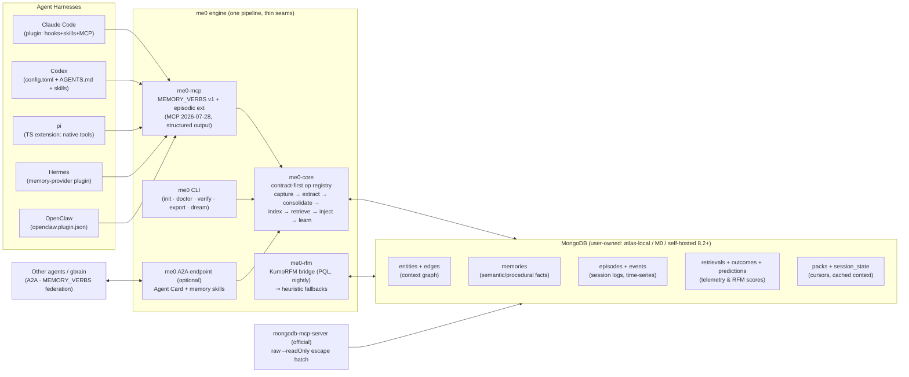

# me0 — goal.md

> **The zeroth layer under every agent: you.**
> me0 is an open-source Agent Plugin that gives any agent harness — Claude Code, Codex, pi, Hermes, OpenClaw — one portable, MongoDB-backed personal context graph and agent session memory. Switch harnesses freely; your context comes with you.

**Status:** north-star specification (v0.1 draft, 2026-08-13) · **License:** MIT · **Repo:** `github.com/GRATITUD3/me0`

---

## 0. TL;DR

Every agent harness today grows its own amnesia workaround: Claude Code has `CLAUDE.md` + auto-memory dirs, Codex reads `AGENTS.md`, Hermes keeps `~/.hermes/memories/MEMORY.md` (2,200-char cap), OpenClaw keeps `MEMORY.md` + daily logs in its workspace, pi keeps JSONL session trees in `~/.pi/agent/sessions/`. Five harnesses, five sandboxed memories, zero portability. The user pays the **context-switching tax**: re-explaining who they are, what the project is, what was decided yesterday, and what the last agent already tried — every time they move.

me0 collapses those silos into **one user-owned memory substrate**:

1. **Personal Context Graph (PCG)** — entities (people, projects, repos, tools, orgs, concepts) + typed edges + bi-temporal facts about *you*: preferences, decisions, commitments, procedures.
2. **Episodic Session Store** — every agent session, from every harness, logged as a first-class `episode` with events, tool calls, outcomes, and an end-of-session distilled summary.
3. **Serving layer** — an MCP server speaking a small, frozen set of memory verbs (`recall`, `remember`, `entity`, `context_pack`, `delta`, `forget`, `synthesize`), conformant with gbrain's MEMORY_VERBS v1 wire protocol; an optional A2A endpoint so *other agents* can query your memory with consent; and the raw MongoDB MCP server as a power-user escape hatch over the same data.
4. **Predictive layer (RFM)** — a Relational Foundation Model (KumoRFM) runs zero-shot predictive queries over me0's own collections to decide *which memories to prefetch, which to forget, what you'll need next* — with deterministic heuristic fallbacks when no RFM is configured.

Packaged per the **Agent Plugins v1.0.0** spec (portable floor: `plugin.json` + `skills/` + `mcp.json`) with native adapters for each harness's richer surface (Claude Code hooks, Hermes memory-provider slot, OpenClaw plugin, pi extension, Codex config).

**The one-line test of success:** start a task in Claude Code, hit your rate limit, open Codex — and the second agent already knows who you are, what the task is, and what the first agent tried. Zero re-explanation.

---

## 1. Problem & Vision

### 1.1 The context-switching tax

Agent harnesses are converging on capability and diverging on memory. As of August 2026:

| Harness | Context file(s) | Session persistence | Memory tooling | Portable? |
|---|---|---|---|---|
| Claude Code | `CLAUDE.md` hierarchy, `.claude/rules/`, auto-memory `MEMORY.md` (~/.claude/projects/…) | transcripts + `/compact` | hooks (30+ events), plugins, skills | ❌ per-harness |
| Codex CLI/IDE | `AGENTS.md` (global + walk-up) | `~/.codex` sessions | MCP via `config.toml`, skills | ❌ |
| pi | `AGENTS.md`, `SYSTEM.md` | JSONL trees `~/.pi/agent/sessions/` | TS extensions, skills, no built-in MCP | ❌ |
| Hermes | `MEMORY.md` (2,200-char cap!), `USER.md`, `SOUL.md` | SQLite `state.db` + FTS5 | plugins (incl. **memory-provider slot**), MCP, skills | ❌ |
| OpenClaw | `MEMORY.md`, `memory/YYYY-MM-DD.md`, `USER.md`, `SOUL.md` | workspace files | plugins, native MCP, `memory_search` | ❌ |

Every row is a silo. None of them share; none survive a harness switch; most are flat files with hard caps. The market's memory products don't fix this either: memtrace is code-structure memory (closed core, per-repo); Mem0/Zep are cloud services centered on *an app's users*, not on *you across your tools*; gbrain is the strongest open substrate but is brain-centric (a knowledge base you feed) rather than user-centric, and has no first-class model of cross-harness agent sessions.

### 1.2 Vision

**Your agents change; you shouldn't have to reintroduce yourself.** me0 inverts ownership: memory is not a feature of the harness, it is a property of the *person*, stored in a database the person controls (local MongoDB or their own Atlas), exposed to any harness through open protocols (MCP today, A2A for agent-to-agent), packaged as a plugin any harness can install in one command.

me0 = **me, indexed from zero**. The zeroth memory every agent should load before it loads anything else. (Also a deliberate wink at Mem0: theirs is memory for apps; me0 is memory of *me*.)

### 1.3 Signature scenario (the "imagine")

```
09:00 Claude Code   me0 SessionStart hook injects a 700-token context pack:
                    identity card, active projects, open threads, yesterday's decisions.
10:30               PreCompact hook banks standing entities; compaction no longer lobotomizes.
11:00 rate-limited  SessionEnd hook: episode summarized, facts extracted, handoff token minted.
11:01 Codex         AGENTS.md preamble + me0 MCP: `context_pack(resume="ep_9f2c")` —
                    Codex picks up mid-task: same repo state, same decisions, knows what
                    Claude Code already tried and why it failed.
18:00 OpenClaw      personal assistant asks me0 `delta(since=cursor)` on heartbeat;
                    it knows about the shipped PR without being told.
02:00 (nightly)     consolidation "dream": dedupe, conflict resolution, decay scoring;
                    KumoRFM predicts tomorrow's needed memories → prefetched into the pack.
```

---

## 2. What me0 Is / Is Not

**Is:**

- A **personal** memory layer: exactly one human at the center; many harnesses, many agents, all writing attributed memory about/for that human.
- A **context graph**: typed entities and edges with provenance and bi-temporal validity — not a pile of chat snippets.
- An **episodic record** of agent work: sessions → events → outcomes, queryable as memory ("what did we decide about auth last Tuesday, and in which harness?").
- A **protocol citizen**: MCP server (spec 2026-07-28, gracefully serving 2025-06-18/2025-11-25 clients), gbrain MEMORY_VERBS v1 conformant, optional A2A v1.0.1 endpoint, Agent Plugins v1.0.0 package, Agent Skills for the teaching layer.
- **User-owned & local-first**: your MongoDB URI, your keys, your export. Default deployment is free (`atlas-local` Docker or Atlas M0).

**Is not (non-goals):**

- Not a world-knowledge base or web-ingesting second brain — gbrain already does that superbly; me0 *federates* with it (same verb protocol) rather than reimplementing pages/sources ingestion.
- Not a hosted SaaS, not a closed core, no license heartbeats, no opt-out telemetry (all lessons from studying memtrace — trust *is* the product for a memory layer).
- Not an agent framework, orchestrator, or model. me0 never runs your agents; it remembers for them.
- Not a vector database product. MongoDB provides the primitives; me0 provides the memory semantics.
- Not per-repo code-structure memory (symbol graphs, AST indexes) — memtrace/ctags territory. me0 stores *decisions about* code, not the code graph itself.

---

## 3. Design Principles

1. **User-centric, not brain-centric.** The unit is the person (`user_id`), not a database. Every write carries `{harness, agent, episode}` attribution.
2. **Verbs-first, additive-forever.** The public surface is 7 frozen memory verbs + a small episodic extension. Every response stamps `protocol_version`. No 157-op sprawl (gbrain's own retrospective lesson — it added `--surface verbs` for a reason).
3. **Deterministic before LLM.** Harness, cwd, repo, files touched, commands, timestamps are parsed at $0 from hooks/logs. LLM spend is reserved for end-of-session fact extraction and optional synthesis. (memtrace's entire cost win; Graphiti's ~50-episodes/min LLM ingestion is the cautionary tale.)
4. **Provenance and bi-temporality on every memory.** `valid_from` / `valid_until` / `superseded_by`; invalidate, never destroy (except user-ordered `forget`, which hard-purges). "What did I believe in March?" must be answerable.
5. **Honest abstention.** Empty recall returns an explicit `CannotProve`-style "no recorded memory" — never a plausible guess. Fabricated memories about a person are worse than none. Every result carries `evidence` and `create_safety` so agents can decide create-vs-update truthfully.
6. **Token cost is a first-class metric.** Server-side budget packing (`budget_used`, `dropped_count`), stable pack prefixes for prompt-cache friendliness, per-call savings ledger, acc-per-kilo-token in the benchmark suite.
7. **Push where hooks exist, pull everywhere.** Deep adapters (hooks/providers) for harnesses that support them; a pull-only MCP + AGENTS.md/skill instruction floor for those that don't. All adapters fail open — memory outage must never block the agent.
8. **Predict, don't just retrieve.** Retrieval telemetry (`retrievals`, `outcomes`) is schema, not an afterthought — it is the training-free fuel for RFM predictive queries (prefetch, forget, next-need). Heuristics when RFM is absent; never a hard dependency.
9. **Consent-scoped sharing.** `visibility: private | shared | world` on every memory; remote callers can never widen scope; A2A callers get redacted packs by default. Fail closed on anything not provably local.
10. **One tree, many harnesses.** A single plugin package satisfies Agent Plugins v1.0.0 *and* each harness's native format, sharing one engine — thin seams, one pipeline, per-seam conformance tests (gbrain's BrainBench adapter architecture).

---

## 4. Standing on Shoulders — What We Take From Each Input

| Source | Adopt | Reject/Fix |
|---|---|---|
| **gbrain** (garrytan/gbrain, v0.45.x) | MEMORY_VERBS v1 wire protocol + conformance certification; contract-first op registry (one `operations.ts` → CLI + MCP); context_pack/delta ambient-recall doctrine with per-session cursors; facts model (kind/visibility/notability/confidence, bi-temporal, mandatory provenance); zero-LLM auto-linking + typed edges; evidence/create_safety result contract; push gating (confidence ≥0.7, cap 3, dedupe); fail-open hook pattern; dream-cycle consolidation; BrainBench-style CI-gated evals; paste-in bootstrap runbook with `verify` exit-0 gate; soft-delete + purge window | Postgres-coupled machinery (pgvector/tsvector/triggers) → MongoDB-native; brain-centric identity → user-centric; markdown-git-repo as system of record → MongoDB primary, git export optional; 157 ops/60 skills surface obesity → verbs-first; push is Claude-Code-only → push adapters for all harnesses; no first-class episodic session model → me0's core addition |
| **memtrace** (syncable-dev/memtrace-public) | Deterministic $0 extraction ethos; skills-teach-tools (MCP tools alone go unused); 8-harness installer path matrix; CannotProve honesty contract; token-savings ledger + rerank pool decoupled from limit; bi-temporal episodes tied to commits; disclosed-losses benchmark culture | Closed core, proprietary EULA, license heartbeat, opt-out telemetry → me0 is MIT, opt-in telemetry only; per-repo code-graph scope → me0 is per-person |
| **Awesome-Agent-Memory-Papers** (90 papers) | Taxonomy as schema: episodic/semantic/procedural externalized as collections; consolidation-by-reflection (Hindsight/TraceMem pattern); Ebbinghaus-style decay (MemoryBank) as forget heuristic; Zep/Graphiti edge-invalidation; A-MEM note-evolution on insert; AWM/ReasoningBank procedural distillation ("how I like PRs written" is memory too); MemoryOS heat-based promotion between tiers; LongMemEval/LoCoMo/MemSim as eval targets | Parametric/latent memory (out of scope); single-benchmark victory laps |
| **Agent Plugins v1.0.0** (agent-plugins.org; TSC: AWS, Cursor, Microsoft, OpenAI, Vercel) | Portable floor: root `plugin.json` (closed schema, `$schema` 1.0.0), `skills/*/SKILL.md`, root `mcp.json` (stdio/streamable-http/legacy sse, `${PLUGIN_ROOT}`/`${PLUGIN_DATA}`); client-extension namespaces for anything richer | Expecting hooks/distribution from the spec (it defines neither — per-client by design) |
| **A2A v1.0.1** (Linux Foundation) | Agent Card at `/.well-known/agent-card.json` advertising memory skills; task lifecycle for long-running synthesis; DataPart for structured packs; extension mechanism for a memory-profile handoff standard; OAuth2/OIDC auth schemes | Making A2A required — it's the inter-agent tier, optional by default |
| **MCP 2026-07-28** | Stateless design (server-minted handles, no session assumptions); `outputSchema` + `structuredContent` on every tool; tasks extension for async consolidation; deterministic tool ordering + `ttlMs` for prompt-cache friendliness | Deprecated roots/sampling reliance; DCR-era OAuth |
| **MongoDB (8.2 / Atlas, 2026)** | `$vectorSearch` (+ scalar/binary quantization, pre-filter), Atlas Search BM25, **`$rankFusion`** native hybrid (8.1+), `$graphLookup` traversal, change streams, TTL indexes, time-series collections for events, `$jsonSchema` validation, Queryable Encryption for a sealed tier, **Voyage automated embedding** (define index → embeddings happen), `atlas-local` Docker for free local-first, official `mongodb-mcp-server` (~v1.12) as the raw escape hatch | Requiring Atlas — community 8.2 + mongot or atlas-local must fully work |
| **KumoRFM / KumoRFM-2** (kumo.ai) | Zero-shot PQL predictions over relational graphs; official `kumo-rfm-mcp` server; free API tier; nightly batch scoring into a `predictions` collection | Hard dependency (no MongoDB connector exists — bridge via Parquet export; heuristics when absent) |

*(Full citations in §18.)*

---

## 5. System Architecture



Layering rules: harnesses never touch MongoDB directly (except via the read-only raw escape hatch); all writes flow through `me0-core`, which enforces schema validation, provenance stamping, visibility, and audit. One engine; per-harness adapters are wire-contract shims scored separately in CI.

---

## 6. Data Model (MongoDB, database `me0`)

Collections with `$jsonSchema` validators; representative fields only (authoritative schemas live in `packages/me0-core/src/schema/`). Design keys: everything hangs off `user_id`; every memory-bearing doc carries `prov` (provenance) and bi-temporal validity; embeddings via Atlas Automated Embedding (Voyage `voyage-4` family) when available, else a local embedding pipeline writing the same fields.

```js
// users — the center of the graph (usually one doc)
{ _id, user_id, names: [], handles: {github, email, …}, identity_card: "≤400-token compiled bio",
  settings: {default_visibility, pack_budget_tokens: 700, push: {min_confidence: 0.7, max_per_turn: 3}},
  consent: [{scope: "a2a:read:world", grantee, granted_at, expires_at}], created_at }

// entities — nodes of the Personal Context Graph
{ _id, user_id, slug, type: "person|org|project|repo|tool|concept|event|place",
  names: [primary, ...aliases], card: "compiled ≤120-token entity card",
  attrs: {…typed per schema-pack…}, status: "verified|auto",           // auto-extracted = quarantined
  embedding: <auto>, salience: 0..1, last_retrieved_at, created_at, updated_at }

// edges — typed, weighted, bi-temporal relations
{ _id, user_id, src: entity_id, dst: entity_id,
  rel: "works_at|founded|maintains|uses|prefers|collaborates_with|part_of|decided_in|mentions|…",
  weight: 0..1, valid_from, valid_until: null, superseded_by: null,
  prov: {episode_id, harness, agent, method: "deterministic|llm", confidence} }

// memories — semantic + procedural facts about/for the user
{ _id, user_id, text, kind: "fact|preference|decision|commitment|belief|procedure",
  tier: "core|standing|recall|archive",       // core = always in pack; heat promotes/demotes (MemoryOS)
  entity_refs: [entity_id], visibility: "private|shared|world",
  valid_from, valid_until, superseded_by, confidence: 0..1, notability: 0..1,
  embedding: <auto>, access: {count, last_retrieved_at},
  prov: {episode_id, harness, agent, method, extracted_at} }

// episodes — one per agent session, any harness (me0's core addition)
{ _id, user_id, episode_id, harness: "claude-code|codex|pi|hermes|openclaw|other",
  agent: {name, model}, project, repo: {remote, branch, cwd},
  started_at, ended_at, status: "active|ended|handed_off",
  title, summary: "LLM-distilled at SessionEnd", outcome: {success, artifacts: [], commits: []},
  handoff: {token, banked_state, minted_at} | null,
  token_stats: {in, out}, tags: [], embedding: <auto on summary> }

// events — time-series collection (timeField: ts, metaField: {episode_id, type}); raw TTL 90d
{ ts, episode_id, type: "prompt|response|tool_call|file_edit|command|error",
  tool, ok, payload: {…compact, capped…} }

// retrievals — telemetry: what memory surfaced where, and did it help (RFM fuel)
{ ts, user_id, episode_id, memory_id, surface: "pack|recall|push|delta", rank, score, used: bool }

// predictions — RFM (or heuristic) scores, TTL 48h
{ subject_type: "memory|entity|session|user", subject_id,
  task: "prefetch|forget|next_tool|success_risk|link", score, horizon, model: "kumo-rfm-2|heuristic", computed_at }

// packs — cached, budgeted context packs; invalidated by change streams
{ user_id, scope: "global|project:<slug>|harness:<name>", content, budget_used, dropped_count,
  generation, computed_at }

// session_state — per-live-session cursor (ambient recall dedupe)
{ episode_id, standing_entities: [], surfaced: [memory_id], delta_cursor, updated_at }

// audit — every write & consent decision, append-only
{ ts, actor: {harness, agent, remote: bool}, op, subject_id, diff_summary }
```

**Indexes.** Vector (`memories.embedding`, `entities.embedding`, `episodes.embedding`; scalar quantization; pre-filter on `{user_id, visibility, kind}`) · Atlas Search BM25 on `memories.text`, `entities.names`, `episodes.summary` · compound `{user_id, tier, kind}`, `{user_id, "prov.episode_id"}` · edges `{user_id, src, rel}` + `{user_id, dst}` for `$graphLookup` both directions · TTL on `events` (raw), `predictions`, soft-deleted docs (72h purge window) · time-series bucketing on `events`.

**Mapping to the research taxonomy:** `memories(kind=fact|preference|belief)` = semantic; `memories(kind=procedure)` + distilled playbooks = procedural (AWM/ReasoningBank); `episodes`+`events` = episodic; `entities`+`edges` = the relational/semantic graph (Zep/Graphiti-style, edge-invalidation not deletion); `packs` = working memory.

---

## 7. Memory Lifecycle

**Capture (deterministic, $0).** Hooks/adapters record episode open/close, prompts (hashes + capped text), tool calls, files touched, commands, git state — parsed, never LLM'd. Harnesses without hooks (Codex) get session bootstrap via skill instruction + `delta` cursors; pi's extension taps `pi.on("tool_call")` natively; OpenClaw/Hermes hooks cover the rest. All capture is fire-and-forget and fail-open with a local disk spool if MongoDB is unreachable.

**Extract (LLM, batched, at session end).** `SessionEnd`/`Stop` triggers one batched extraction over the transcript: typed facts, new entities (quarantined as `status:"auto"` until promoted), typed edges, episode summary, procedural lessons ("user prefers conventional commits; squash-merge"). Inline per-turn extraction is deliberately avoided — it taxes latency and churns prompt-cache prefixes. Extraction runs Mem0-style conflict resolution: `ADD | UPDATE (supersede) | INVALIDATE | NOOP` against existing memories, honoring bi-temporality.

**Consolidate (nightly "dream").** Change-stream-driven + scheduled jobs: dedupe entities (alias merge), resolve contradictions (or record them as flagged pairs), decay scoring (Ebbinghaus-style on `access`), tier promotion/demotion by heat, A-MEM-style neighbor evolution (new memory updates the cards of linked entities), compile `identity_card` and entity `card`s, refresh packs, write `audit`.

**Index.** Automated Embedding handles vectors on insert/update where available; otherwise the local pipeline (stale-driven, spend-gated). BM25 and graph edges are maintained transactionally with writes.

**Retrieve.** See §8.

**Inject.** Context packs + gated push (§8).

**Learn.** Every surface event is a `retrievals` row; `used` is inferred (agent cited/act-ed on it) or hook-reported. Nightly, me0-rfm scores `predictions`; ranking weights consume them (§12).

---

## 8. Retrieval Engine & Context Packs

**Query path** (one aggregation where possible):

1. Intent classify (deterministic: entity / temporal / event / general — regex + cheap features, no LLM).
2. Hybrid recall: `$rankFusion` over named arms — `$vectorSearch` (pre-filtered), BM25, exact-title/alias arm, and a **relational arm** (`$graphLookup` fanout over typed edges for "who/what is connected to X" questions). gbrain's benchmark lesson is load-bearing: P@5 49.1 full-stack vs ~18 vector-only — a lift its docs attribute to the graph arm plus extraction quality together; me0 keeps both.
3. Post-fusion boosts: recency, salience, tier, backlink count, **RFM utility weight** when present.
4. Dedup → optional rerank (Voyage `rerank-2.5`, pool decoupled from caller `limit`) → token-budget packing.
5. Response carries per-result `evidence` (`alias_hit|exact_title|high_vector|keyword|weak_semantic`), `create_safety` (`exists|probable|unknown`), and `_meta: {budget_used, dropped_count, tokens_saved}`.

Three **modes** bundle knobs under one key: `conservative | balanced | tokenmax`. Degraded operation is a feature: keyless mode = BM25+graph only; offline mode = last cached pack.

**Context pack** (the always-injected tier): stable-prefix, ≤ `pack_budget_tokens` (default 700): identity card → active projects + open threads → standing decisions/preferences relevant to scope → yesterday's episode summaries → resume state if `handoff` token present. Scoped variants per project/harness. **`delta`** returns only changes since the session's cursor (at-least-once, deduped via `session_state`) — the heartbeat verb for long-lived assistants.

**Push** (harnesses with `UserPromptSubmit`-class hooks): per-turn ambient recall, confidence-gated (≥0.7), capped (≤3), suppressed if already surfaced this session; false-fire rate is a tracked CI metric, not a vibe.

---

## 9. Interfaces

### 9.1 me0-mcp tool surface (the verbs)

Frozen core — conformant with **gbrain MEMORY_VERBS v1** (every response stamps `protocol_version: 1`; additive-forever; certifiable via `gbrain protocol conformance --target`):

| Verb | Purpose | Notes |
|---|---|---|
| `recall` | hybrid memory search | modes, filters (kind/tier/time/entity), evidence + abstention |
| `remember` | write a memory/fact | typed, provenance auto-stamped, conflict resolution, `create_safety` honored |
| `entity` | zero-LLM entity card + neighbors | cheap per-message lookup |
| `context_pack` | budgeted session-start pack | `scope`, `resume` (handoff token), stable prefix |
| `delta` | changes since cursor | per-session cursor, at-least-once |
| `forget` | user-ordered removal | soft-delete → 72h purge; also scope-wide (`forget entity:X`) |
| `synthesize` | cited prose answer + gap analysis | optional; degrades to `recall` when keyless |

Episodic extension (me0 namespace, additive):

| Tool | Purpose |
|---|---|
| `episode_start` / `episode_log` / `episode_end` | session lifecycle + event append (hooks call these; agents may too) |
| `episode_recall` | search past sessions ("what did we try on the auth bug?") |
| `handoff` | bank live state → mint resume token (cross-harness switch) |
| `whoami` | identity card + consent scopes in force |
| `me0_stats` | token-savings ledger, memory counts, health |

All tools declare `outputSchema` (MCP 2026-07-28) with `structuredContent`; server is stateless with server-minted cursors/handles; tool lists are deterministically ordered with `ttlMs` for client prompt-cache reuse. Transports: stdio (default) + streamable-HTTP (OAuth 2.1; pre-registered clients; DCR off).

### 9.2 Raw escape hatch

Power users point the official `mongodb-mcp-server` (`--readOnly`) at the same URI: ad-hoc `aggregate`, `collection-schema`, `explain`, `export` over their own memory. me0 documents this as a supported surface; the `$jsonSchema` validators are the contract that makes it safe.

### 9.3 A2A endpoint (optional, `me0 serve --a2a`)

- Agent Card at `/.well-known/agent-card.json`: skills `memory.recall`, `memory.context_pack`, `memory.remember` (consent-gated), tags, auth schemes (OAuth2/OIDC/bearer), `capabilities.streaming: true`.
- me0 A2A **extension** `https://me0.dev/a2a/ext/memory-profile/v1`: a standard shape for requesting a redacted profile pack as a `DataPart` — the seed of a portable "memory handoff" convention between assistants.
- Long-running `synthesize` runs as an A2A task (`submitted → working → completed`) with artifacts.
- Hard rule: A2A callers are `remote`; visibility ceiling `world` (or `shared` per explicit consent grant); redaction always on; every call audited.

### 9.4 Federation

me0 and gbrain speak the same verbs: a harness can mount both (me0 = you + your sessions; gbrain = your knowledge corpus), or me0 can proxy `recall` misses to a configured gbrain (`federation.upstreams`). Source-scoped results; no cross-writing.

---

## 10. Harness Adapters

| Harness | Wire-in | Capture depth | Injection |
|---|---|---|---|
| **Claude Code** | native plugin (`.claude-plugin/plugin.json`) via marketplace; bundles `.mcp.json`, skills, `hooks/hooks.json` | **full**: `SessionStart`, `UserPromptSubmit`, `PostToolUse` (batched), `PreCompact`, `SessionEnd` | pack at SessionStart (`hookSpecificOutput.additionalContext`), gated push per prompt, PreCompact banking + PostCompact rehydration; can back auto-memory via `autoMemoryDirectory` |
| **Codex** | `~/.codex/config.toml` `[mcp_servers.me0]` + `~/.codex/AGENTS.md` preamble + `$me0` skill in `~/.agents/skills` | pull-only (no hooks): episode bootstrap on first tool call; `delta` per skill instruction | static preamble + on-demand `context_pack`/`recall` |
| **pi** | TS extension in `~/.pi/agent/extensions/me0.ts` — registers `memory_*` tools *directly* (pi has no built-in MCP by design), `pi.on("tool_call")` for capture | **full** via extension events; session JSONL import (`~/.pi/agent/sessions/`) as backfill | tool-injected pack + AGENTS.md note |
| **Hermes** | **memory-provider plugin** (`plugin.yaml`, `plugins/memory/me0/`) — replaces the 2,200-char `MEMORY.md` cap with the graph; also MCP via `~/.hermes/config.yaml` | pre/post-LLM + session hooks via `ctx.register_hook` | provider slot = me0 *is* Hermes memory; frozen-snapshot pack preserves its prefix-cache design |
| **OpenClaw** | `openclaw.plugin.json` (tools + `api.registerHook` lifecycle + config `mongodb_uri`); swaps file-based `memory_search`/`memory_get` backend | session + pre-compaction hooks; daily-log import as backfill | pack into workspace bootstrap; `delta` on gateway heartbeat |
| **Anything else** | Agent Plugins v1 package: `plugin.json` + `mcp.json` + skills — the portable floor (ChatGPT, Cursor, Copilot, Kiro, VS Code, Goose, OpenCode, …) | pull-only | skill-taught verbs |

One command wires everything: `npx me0 init` detects installed harnesses and writes each config in place (memtrace's installer-matrix pattern: `~/.claude`, `~/.codex/config.toml`, `~/.pi/agent/`, `~/.hermes/config.yaml`, `openclaw.json`), provisions storage (`atlas-local` Docker → or `atlas-create-free-cluster` via the official MCP → or an existing URI), runs a short identity interview to seed `users` + `identity_card`, then gates on **`me0 verify`** (exit 0 = every seam round-trips a write→recall→pack). `me0 doctor` diagnoses drift. Backfill importers: Claude Code auto-memory + transcripts, pi JSONL, Hermes `state.db`, OpenClaw `memory/*.md`, plus `CLAUDE.md`/`AGENTS.md`/`MEMORY.md`/`USER.md`/`SOUL.md` file ingestion — *the migration path is the adoption wedge.*

## 11. Packaging & Distribution

```
me0/                                  # one tree, three audiences
├── plugin.json                       # Agent Plugins v1.0.0 (closed schema, $schema pinned)
├── mcp.json                          # {mcpServers: {me0: {type:"stdio", command:"me0-mcp",
│                                     #   env: {ME0_DATA: "${PLUGIN_DATA}"}}}}
├── skills/                           # Agent Skills (agentskills.io) — read by 40+ clients
│   ├── me0/SKILL.md                  # when to recall/remember; trigger phrases;
│   │                                 #   "if recall returns no-memory, say so — do not guess"
│   ├── me0-handoff/SKILL.md          # switching harness mid-task
│   └── me0-setup/SKILL.md            # init/doctor/verify runbook (paste-in bootstrap)
├── .claude-plugin/plugin.json        # Claude Code native superset
├── hooks/hooks.json                  # Claude Code hook set
├── openclaw.plugin.json              # OpenClaw plugin manifest
├── hermes/plugin.yaml                # Hermes memory-provider plugin
├── extensions/pi/me0.ts              # pi extension
└── packages/
    ├── me0-core/                     # engine; contract-first src/operations.ts (scope: read|write|admin,
    │                                 #   localOnly flags) → MCP + CLI + A2A generated, zero drift
    ├── me0-mcp/                      # MCP server binary
    ├── me0-cli/                      # init · doctor · verify · export · import · dream · serve
    ├── me0-rfm/                      # KumoRFM bridge (Parquet export → PQL → predictions)
    └── me0-bench/                    # eval harness (§14)
```

TypeScript on Bun (single-binary compile, gbrain-proven); npm `me0` + `me0-mcp`; Docker `me0/me0`; Claude Code marketplace entry (`marketplace.json`) + ClawHub (`openclaw plugins install clawhub:me0`) + Hermes (`hermes plugins install GRATITUD3/me0`). Persistent state only ever in `${PLUGIN_DATA}`/`${CLAUDE_PLUGIN_DATA}` or the DB — never plugin root. Versioning: SemVer; wire protocol additive-forever; schema migrations forward-only with `me0 doctor --migrate`.

---

## 12. The RFM Layer — Predictive Memory

Classical memory systems retrieve *reactively*. me0's schema is deliberately relational telemetry (`users → episodes → events/retrievals → memories/entities/edges → outcomes`) so a **Relational Foundation Model** can predict over it zero-shot — no feature engineering, no training loop. Bridge: nightly `me0 dream --rfm` exports the collections to Parquet (`export` op / `$out`), materializing RFM-friendly flat tables — `sessions` (from `episodes`), `tool_calls` (from `events` where `type="tool_call"`), `outcomes` (from `episodes.outcome`), plus `memories`, `entities`, `edges`, `retrievals` (with `_id` exported as `memory_id`/`entity_id`/… so PQL columns resolve; each table carries a primary key + time column; FKs = graph edges) — builds a KumoRFM LocalGraph, runs PQL, writes scores to `predictions` (TTL 48h). Via `kumoai` SDK or the official `kumo-rfm-mcp` server; free API tier exists; **no MongoDB connector exists today — the Parquet bridge is ours** (and upstreamable).

| Predictive task | PQL sketch | Consumed by | Keyless fallback |
|---|---|---|---|
| Prefetch next-session memories | `PREDICT LIST_DISTINCT(retrievals.memory_id, 0, 24, hours) FOR EACH users.user_id` | pack assembly (pre-rank) | recency×frequency×vector score |
| Forget/staleness scoring | `PREDICT COUNT(retrievals.*, 0, 90, days)=0 FOR EACH memories.memory_id` | tier demotion, archive TTL | Ebbinghaus decay on `access` |
| Next-tool prediction | `PREDICT LIST_DISTINCT(tool_calls.tool_name, 0, 1, hours) FOR EACH sessions.session_id` | adapter prewarm, skill hints | 1st-order Markov matrix |
| Session-failure early warning | `PREDICT COUNT(outcomes.success=0, 0, 2, hours)>0 FOR EACH sessions.session_id` | inject more context / escalate | logistic on error-rate features |
| Entity link prediction | `PREDICT LIST_DISTINCT(edges.dst, 0, 30, days) FOR EACH entities.entity_id` | graph completion, merge hints | Adamic-Adar via `$graphLookup` |
| Dormancy → consolidation | `PREDICT COUNT(sessions.*, 0, 14, days)=0 FOR EACH users.user_id` | dream scheduling | recency threshold |
| Retrieval-utility rerank | `PREDICT COUNT(retrievals.used=1, 0, 7, days)>0 FOR EACH memories.memory_id` | `$rankFusion` arm weights | historical used/surfaced ratio |

Rule: **RFM is an enhancement tier, never a dependency.** Every consumer reads `predictions` opportunistically and falls back silently. As far as our research found, no shipped system combines an RFM with agent-memory telemetry for prefetch/forget — this is me0's novel contribution and should be published as such (design note + eval).

---

## 13. Privacy, Security, Ownership

The blast radius of a personal context graph is total — it is PII by construction. Non-negotiables:

- **Ownership:** user's MongoDB URI (local `atlas-local` by default), user's keys, one-command `me0 export` (JSONL + markdown mirror) and `me0 import`. Deleting me0 deletes me0 — no residue in a vendor cloud.
- **Trust boundary (fail closed):** every op context carries `remote`; anything not provably local is untrusted. Remote/A2A callers: visibility ceiling, redaction, no scope widening, rate limits, full audit. (gbrain's `OperationContext.remote` doctrine, kept verbatim.)
- **Visibility:** `private | shared | world` per memory; packs for remote consumers are world-only unless an explicit consent grant (scoped, expiring) says otherwise; consent grants are first-class documents with an audit trail.
- **Sealed tier:** Queryable Encryption on designated fields (health, finance, credentials-adjacent facts) — equality/range queryable, never vector-indexed, never in packs for any remote caller.
- **Forgetting is real:** `forget` soft-deletes with a 72h purge window, then hard-purges doc + embeddings + pack caches + exports log entry to `audit`.
- **Auth:** stdio = local trust; HTTP/A2A = OAuth 2.1 + PKCE, pre-registered clients (Client ID Metadata Documents; no DCR), bearer tokens scoped `read|write|admin` per the op registry.
- **Telemetry:** none by default; opt-in only, with a published TELEMETRY.md-grade datasheet (memtrace's datasheet rigor, inverted default). Supply chain: Gitleaks/OSV/Semgrep in CI, signed release artifacts.
- **Hygiene:** example corpora and benchmarks use synthetic personas (MemSim-style) — never real names from anyone's actual graph.

---

## 14. Evaluation — me0-bench

CI-gated, hermetic (in-memory `mongodb-memory-server`/atlas-local, 100+ fixture corpus, no API keys), scored **per harness seam** — every memory PR must move or hold a number:

- **Continuity score (signature metric):** scripted task starts in harness A, forcibly switches to B mid-task; measure re-explanation tokens, redundant tool calls, and task success vs a no-me0 baseline. This is the product promise, measured.
- **know_to_ask_failure_rate** (agent had the memory but didn't use it) and **false_fire_rate / push precision–recall** (gbrain BrainBench metrics, adopted wholesale).
- **Write-back fidelity:** facts stated in-session that survive to next session, with correct type/provenance/validity.
- **Abstention accuracy:** LoCoMo-style adversarial questions; "no recorded memory" must beat fabrication.
- **Token economy:** acc-per-kilo-token; pack budget adherence; savings ledger truthfulness.
- **Public benchmarks:** LongMemEval (all five abilities), LoCoMo, MemSim/KnowMe-Bench-style personal-assistant sims. Publish disclosed losses too (memtrace's honesty culture) — e.g., where a flat vector store beats us on cheap NL recall.
- **Ops SLOs:** `entity` < 50ms; `context_pack` (cached) < 100ms; hybrid `recall` p95 < 700ms on M0-class hardware; hook sync paths < 150ms (else async spool).

---

## 15. Roadmap

**v0.1 — the spine (weeks 1–4).** me0-core op registry + Mongo schema/validators + indexes; the 7 verbs + `episode_*` over stdio MCP; deterministic capture + SessionEnd extraction; Claude Code plugin (hooks) + Codex config; `me0 init/verify/doctor` with atlas-local; skills; export/import. *Exit: continuity demo Claude Code → Codex on video, me0-bench v0 green.*

**v0.2 — every harness, both directions (weeks 5–8).** pi extension, Hermes memory-provider, OpenClaw plugin; push with gating; backfill importers (CLAUDE.md/AGENTS.md/MEMORY.md/session stores); nightly dream (dedupe, decay, cards, packs); handoff tokens; `$rankFusion` hybrid + rerank. *Exit: 5/5 harnesses pass seam conformance; BrainBench-style dashboard public.*

**v0.3 — predict & federate (weeks 9–12).** me0-rfm bridge + `predictions` + fused ranking (A/B vs heuristics in-bench); A2A endpoint + memory-profile extension; gbrain federation; Queryable Encryption sealed tier; streamable-HTTP + OAuth. *Exit: RFM lift on prefetch/forget quantified and published.*

**v1.0 — the standard candle.** MEMORY_VERBS conformance certification both directions; marketplace listings (Claude Code official/community, ClawHub, Hermes, Agent Plugins registries as they emerge); additive-forever wire guarantee; benchmark paper/design note ("RFM-optimized personal agent memory"); stability policy.

---

## 16. Open Questions

1. **Local-zero story.** atlas-local Docker is our floor, but gbrain's PGLite boots in ~2s with zero daemons — do we need an embedded fallback tier (ferretDB/SQLite shim implementing the verb subset) for laptop-only users, at the cost of dual-engine parity tax gbrain warns about?
2. **`used` signal fidelity.** Inferring whether an injected memory actually helped (cited vs ignored) is noisy without harness cooperation — how far can PostToolUse/transcript analysis get before we need a harness-side attribution convention?
3. **Multi-human households/teams.** v1 is strictly one user; the moment two humans share an OpenClaw gateway, source-scoping questions return. Defer, but don't paint out.
4. **A2A memory-profile extension governance.** Propose under me0.dev or push into the A2A extensions registry early?
5. **Agent Plugins vs Anthropic.** The spec's TSC excludes Anthropic; Claude Code keeps its superset. Betting on "one tree satisfies both" is right today — watch for divergence.
6. **RFM privacy posture.** Kumo's free API means telemetry-shaped data leaves the machine when RFM is enabled — needs its own consent gate, redaction pass (structure without content: IDs + timestamps only), and a documented data-flow.

---

## 17. Definition of Done (v0.1)

`npx me0 init` on a clean Mac with Claude Code + Codex installed → storage provisioned, both harnesses wired, identity interviewed → user does a real task in Claude Code, kills it mid-way, opens Codex → Codex's first response demonstrates knowledge of the user, the task, and the prior attempt, with `me0_stats` showing the pack cost < 800 tokens → `me0 verify` exits 0 → `me0 export` produces a complete, human-readable archive. Everything MIT, everything local, no telemetry.

---

## 18. References

**Repos analyzed** · gbrain — https://github.com/garrytan/gbrain (v0.45.x; DESIGN.md, `src/core/operations.ts`, MEMORY_VERBS, BrainBench, `openclaw.plugin.json`) · agent-plugins-example — https://github.com/agentplugins/agent-plugins-example · memtrace — https://github.com/syncable-dev/memtrace-public (architecture, benchmarks, TELEMETRY.md, plugins/) · Awesome-Agent-Memory-Papers — https://github.com/yyyujintang/Awesome-Agent-Memory-Papers (90 papers; taxonomy tags)

**Specs & protocols** · Agent Plugins v1.0.0 — https://agent-plugins.org/specification · https://agent-plugins.org/plugin-authors · Vercel announcement — https://vercel.com/blog/introducing-agent-plugins · Agent Skills — https://agentskills.io/specification · A2A v1.0.1 — https://a2a-protocol.org/latest/specification/ · A2A↔MCP — https://a2a-protocol.org/latest/topics/a2a-and-mcp/ · MCP 2026-07-28 — https://modelcontextprotocol.io/specification/2026-07-28/changelog

**Harnesses** · Claude Code plugins/hooks/memory — https://code.claude.com/docs/en/plugins · /hooks · /memory · Codex MCP/skills — https://learn.chatgpt.com/docs/extend/mcp · pi — https://github.com/badlogic/pi-mono · Hermes Agent — https://hermes-agent.nousresearch.com/docs · OpenClaw — https://docs.openclaw.ai (plugin, memory, mcp, gateway)

**Infra** · MongoDB MCP server — https://github.com/mongodb-js/mongodb-mcp-server · https://www.mongodb.com/docs/mcp-server/tools/ · $rankFusion hybrid — https://www.mongodb.com/docs/atlas/atlas-vector-search/hybrid-search/ · self-managed search/vector (8.2) — mongodb.com blog, "Supercharge self-managed apps" · Automated Embedding (Voyage) — mongodb.com blog, "AI search for agents" · KumoRFM — https://kumo.ai · kumo-rfm-mcp — https://github.com/kumo-ai/kumo-rfm-mcp · KumoRFM-2 — arXiv:2604.12596

**Research anchors** · Memory survey — arXiv:2404.13501 · "Memory in the Age of AI Agents" — arXiv:2512.13564 · LoCoMo — arXiv:2402.17753 · LongMemEval — arXiv:2410.10813 · MemSim — arXiv:2409.20163 · MemoryOS — EMNLP'25 · HippoRAG / A-MEM / AWM / ReasoningBank / MemoryBank — per survey index · Episodic-memory risks — arXiv:2501.11739

---

*me0: because the most important context an agent can load is the person it works for.*